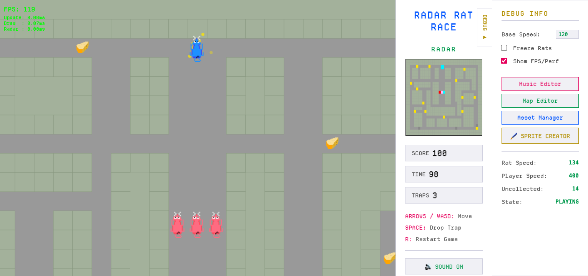
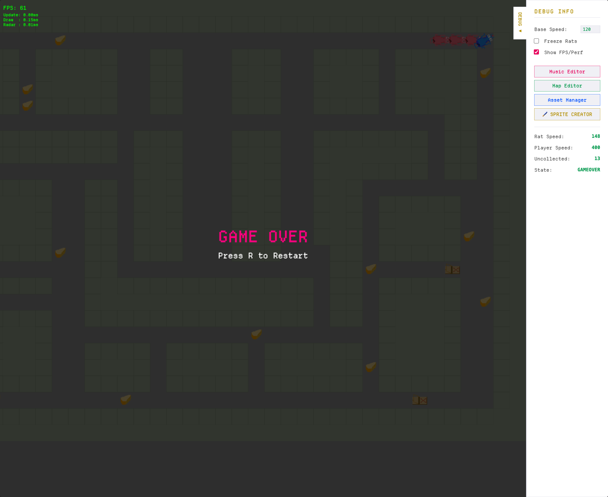
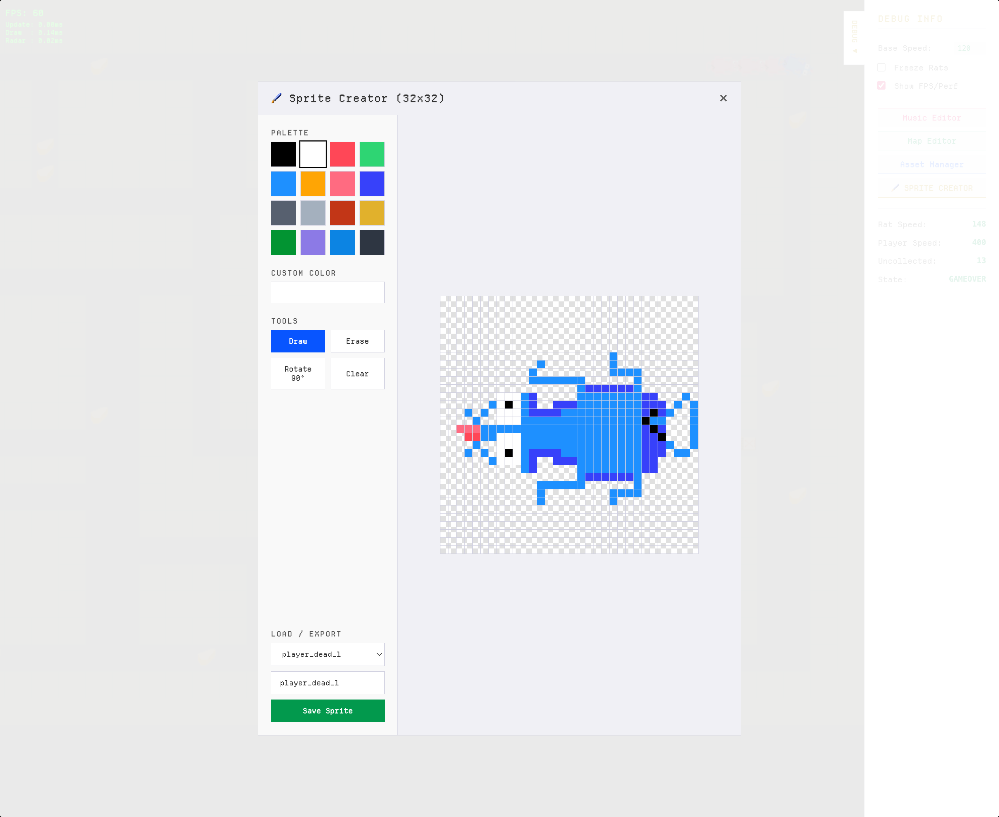
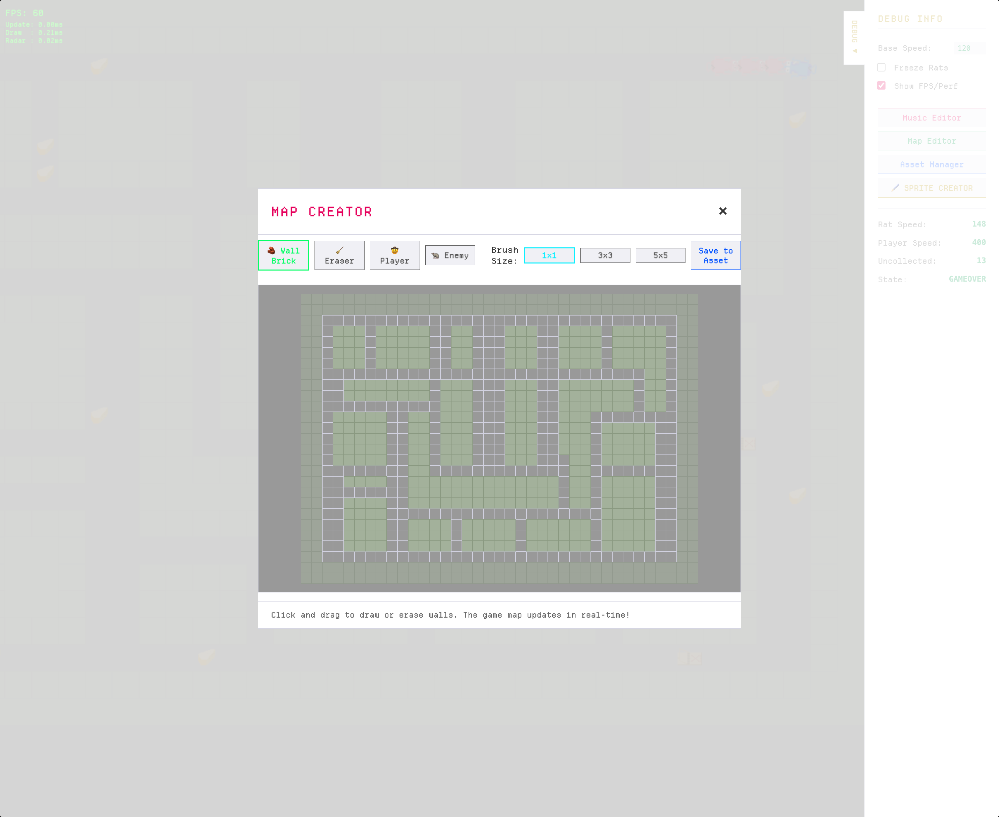
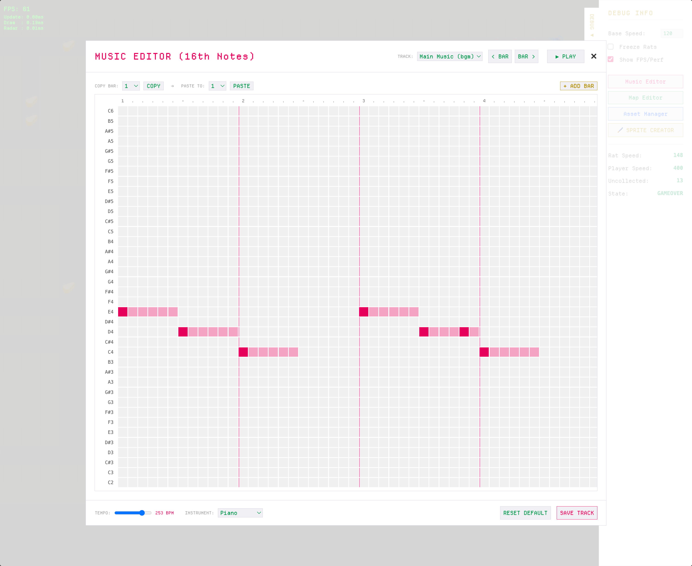
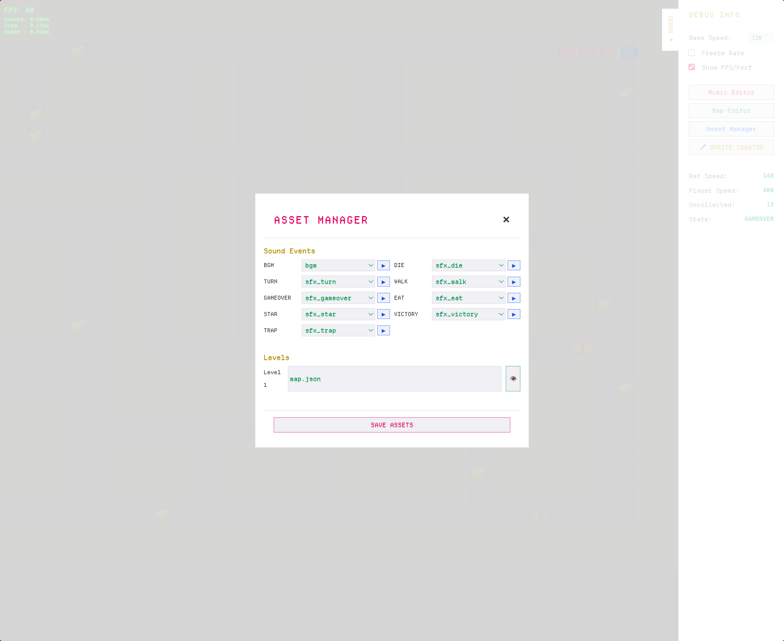

# Radar Rat Race

A web-based remake/re-imagining of the classic game "Radar Rat Race", built using React, Vite, and TypeScript. The game features a custom HTML5 Canvas-based engine and a full suite of in-browser development tools for maps, sprites, music, and asset management.

[](https://youtu.be/skqxRRzD18w)
## 📸 Screenshots

### Gameplay


### Game Over


---

## 🛠 Built-in Developer Tools

This project features an extensive suite of custom, in-game developer tools that allow you to modify the game's assets on the fly!

### Sprite Editor


### Map Editor


### Music Editor


### Asset Manager


## 🚀 How to Start the App

### Prerequisites
Make sure you have [Node.js](https://nodejs.org/) installed on your machine.

### Installation
1. Clone the repository or download the source code.
2. Open a terminal and navigate to the project directory:
   ```bash
   cd radar-rat-race
   ```
3. Install the dependencies:
   ```bash
   npm install
   ```

### Running Locally
To start the development server, run:
```bash
npm run dev
```
Then, open [http://localhost:5173](http://localhost:5173) in your browser to play the game!

### Capturing Automated Screenshots
This project uses Playwright to automatically interact with the game and capture screenshots of the gameplay and dev tools.
```bash
# Run the end-to-end tests to generate new screenshots
npm run test:e2e
```
Generated screenshots will be saved directly into the `screenshots/` directory.

## 📂 Project Structure

- **`src/game/`**: The core game engine. Includes the game loop (`GameLoop.ts`), state management (`GameState.ts`), canvas rendering (`Renderer.ts`), input handling (`InputSystem.ts`), and audio synthesis (`AudioSystem.ts`).
- **`src/components/`**: The React UI components surrounding the game canvas, including the Sidebar, Radar, Game Controls, and Stats.
- **`src/devtools/`**: The custom suite of developer tools (Map Editor, Music Editor, Asset Manager, Bitmap/Sprite Editor) injected into the app.
- **`tests/`**: Playwright end-to-end tests, currently configured for automated screenshot generation.
- **`screenshots/`**: Directory containing images of the game and dev tools.
